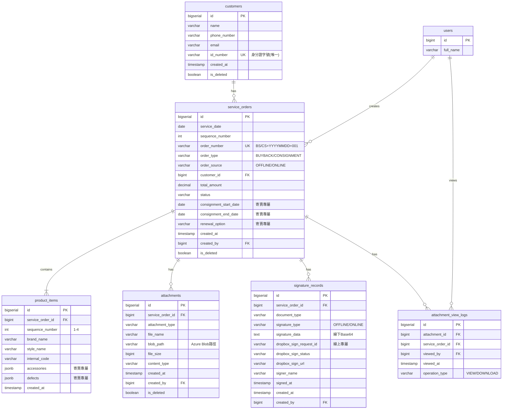

# Data Model: 服務單管理模組

**Feature**: 服務單管理模組  
**Branch**: `007-service-order-management`  
**Date**: 2025-12-16  
**Database**: PostgreSQL 15+

---

## 實體關聯圖 (ERD)



---

## 資料表設計

### 1. customers (客戶表)

**用途**: 儲存客戶基本資訊,支援多種關鍵字搜尋

| 欄位名稱 | 型別 | 約束 | 說明 |
|----------|------|------|------|
| `id` | BIGSERIAL | PRIMARY KEY | 主鍵 |
| `name` | VARCHAR(100) | NOT NULL | 客戶姓名 |
| `phone_number` | VARCHAR(20) | NOT NULL | 聯絡電話 |
| `email` | VARCHAR(100) | NULL | 電子郵件 |
| `id_number` | VARCHAR(10) | NOT NULL, UNIQUE | 身分證字號/外籍人士格式 |
| `created_at` | TIMESTAMP | NOT NULL DEFAULT NOW() | 建立時間 |
| `created_by` | BIGINT | NOT NULL | 建立者 |
| `updated_at` | TIMESTAMP | NULL | 最後更新時間 |
| `updated_by` | BIGINT | NULL | 最後更新者 |
| `is_deleted` | BOOLEAN | NOT NULL DEFAULT FALSE | 軟刪除標記 |
| `deleted_at` | TIMESTAMP | NULL | 刪除時間 |
| `deleted_by` | BIGINT | NULL | 刪除者 |

**索引**:
- `idx_customers_id_number` ON `id_number`
- `idx_customers_phone_number` ON `phone_number`
- `idx_customers_email` ON `email`
- `idx_customers_name` ON `name` (支援模糊搜尋)

**驗證規則**:
- `id_number` 格式: 台灣身分證 (1英文+9數字) 或外籍人士 (8位西元出生日期+2位英文大寫)
- `phone_number` 台灣手機格式 09XX-XXXXXX

---

### 2. service_orders (服務單主表)

**用途**: 儲存收購單與寄賣單的核心資訊

| 欄位名稱 | 型別 | 約束 | 說明 |
|----------|------|------|------|
| `id` | BIGSERIAL | PRIMARY KEY | 主鍵 |
| `service_date` | DATE | NOT NULL DEFAULT CURRENT_DATE | 服務日期 |
| `sequence_number` | INT | NOT NULL | 當日序號 (1-999) |
| `order_number` | VARCHAR(20) | GENERATED ALWAYS AS, UNIQUE | 服務單編號 (BS/CS+YYYYMMDD+001) |
| `order_type` | VARCHAR(20) | NOT NULL | 服務單類型 (BUYBACK/CONSIGNMENT) |
| `order_source` | VARCHAR(20) | NOT NULL | 來源 (OFFLINE/ONLINE) |
| `customer_id` | BIGINT | NOT NULL, FK | 客戶 ID |
| `total_amount` | DECIMAL(10,2) | NOT NULL DEFAULT 0 | 總金額 |
| `status` | VARCHAR(20) | NOT NULL DEFAULT 'PENDING' | 狀態 (PENDING/COMPLETED/TERMINATED) |
| `consignment_start_date` | DATE | NULL | 寄賣起始日期 (寄賣單專屬) |
| `consignment_end_date` | DATE | NULL | 寄賣結束日期 (寄賣單專屬) |
| `renewal_option` | VARCHAR(50) | NULL | 續約設定 (寄賣單專屬) |
| `created_at` | TIMESTAMP | NOT NULL DEFAULT NOW() | 建立時間 |
| `created_by` | BIGINT | NOT NULL, FK | 建立者 |
| `updated_at` | TIMESTAMP | NULL | 最後更新時間 |
| `updated_by` | BIGINT | NULL, FK | 最後更新者 |
| `is_deleted` | BOOLEAN | NOT NULL DEFAULT FALSE | 軟刪除標記 |
| `deleted_at` | TIMESTAMP | NULL | 刪除時間 |
| `deleted_by` | BIGINT | NULL, FK | 刪除者 |

**約束條件**:
```sql
CONSTRAINT chk_order_type CHECK (order_type IN ('BUYBACK', 'CONSIGNMENT'))
CONSTRAINT chk_order_source CHECK (order_source IN ('OFFLINE', 'ONLINE'))
CONSTRAINT chk_status CHECK (status IN ('PENDING', 'COMPLETED', 'TERMINATED'))
CONSTRAINT chk_consignment_dates CHECK (
    (order_type = 'CONSIGNMENT' AND consignment_start_date IS NOT NULL AND consignment_end_date IS NOT NULL)
    OR (order_type = 'BUYBACK' AND consignment_start_date IS NULL AND consignment_end_date IS NULL)
)
CONSTRAINT chk_consignment_date_range CHECK (
    consignment_end_date IS NULL OR consignment_end_date > consignment_start_date
)
CONSTRAINT chk_renewal_option CHECK (
    renewal_option IS NULL OR renewal_option IN ('AUTO_RETRIEVE', 'AUTO_DISCOUNT_10', 'DISCUSS')
)
CONSTRAINT uk_service_orders_date_seq UNIQUE (service_date, sequence_number)
```

**索引**:
- `idx_service_orders_order_number` ON `order_number`
- `idx_service_orders_customer_id` ON `customer_id`
- `idx_service_orders_order_type` ON `order_type`
- `idx_service_orders_status` ON `status`
- `idx_service_orders_service_date` ON `service_date DESC`
- `idx_service_orders_created_at` ON `created_at DESC`

**計算欄位** (`order_number`):
```sql
GENERATED ALWAYS AS (
    CASE 
        WHEN order_type = 'BUYBACK' THEN 'BS'
        WHEN order_type = 'CONSIGNMENT' THEN 'CS'
    END || TO_CHAR(service_date, 'YYYYMMDD') || LPAD(sequence_number::TEXT, 3, '0')
) STORED
```

---

### 3. product_items (商品項目表)

**用途**: 儲存服務單的商品項目 (1-4 件)

| 欄位名稱 | 型別 | 約束 | 說明 |
|----------|------|------|------|
| `id` | BIGSERIAL | PRIMARY KEY | 主鍵 |
| `service_order_id` | BIGINT | NOT NULL, FK | 服務單 ID |
| `sequence_number` | INT | NOT NULL | 商品序號 (1-4) |
| `brand_name` | VARCHAR(100) | NOT NULL | 品牌名稱 |
| `style_name` | VARCHAR(100) | NOT NULL | 款式 |
| `internal_code` | VARCHAR(50) | NULL | 內碼 |
| `accessories` | JSONB | NULL | 配件 (寄賣單專屬,陣列格式) |
| `defects` | JSONB | NULL | 瑕疵處 (寄賣單專屬,陣列格式) |
| `created_at` | TIMESTAMP | NOT NULL DEFAULT NOW() | 建立時間 |
| `updated_at` | TIMESTAMP | NULL | 最後更新時間 |

**約束條件**:
```sql
CONSTRAINT chk_sequence_number CHECK (sequence_number BETWEEN 1 AND 4)
CONSTRAINT uq_service_order_sequence UNIQUE (service_order_id, sequence_number)
```

**索引**:
- `idx_product_items_service_order_id` ON `service_order_id`
- `idx_product_items_accessories` ON `accessories` USING GIN
- `idx_product_items_defects` ON `defects` USING GIN

**配件選項** (JSONB 陣列值):
```json
["BOX", "DUST_BAG", "RECEIPT", "SHOPPING_BAG", "SHOULDER_STRAP", 
 "FELT_PAD", "PILLOW", "WARRANTY_CARD", "LOCK_KEY", "RIBBON_FLOWER", 
 "BRAND_CARD", "CERTIFICATE", "NONE"]
```

**瑕疵選項** (JSONB 陣列值):
```json
["HARDWARE_RUST", "HARDWARE_SCRATCH", "HARDWARE_MISSING", 
 "LEATHER_SCRATCH", "LEATHER_WEAR", "LEATHER_DENT", 
 "LINING_DIRTY", "CORNER_WEAR"]
```

---

### 4. attachments (附件表)

**用途**: 儲存服務單相關附件 (身分證明、合約文件等)

| 欄位名稱 | 型別 | 約束 | 說明 |
|----------|------|------|------|
| `id` | BIGSERIAL | PRIMARY KEY | 主鍵 |
| `service_order_id` | BIGINT | NOT NULL, FK | 服務單 ID |
| `attachment_type` | VARCHAR(50) | NOT NULL | 附件類型 |
| `file_name` | VARCHAR(255) | NOT NULL | 原始檔名 |
| `blob_path` | VARCHAR(500) | NOT NULL | Azure Blob Storage 路徑 |
| `file_size` | BIGINT | NOT NULL | 檔案大小 (bytes) |
| `content_type` | VARCHAR(100) | NOT NULL | MIME 類型 |
| `created_at` | TIMESTAMP | NOT NULL DEFAULT NOW() | 上傳時間 |
| `created_by` | BIGINT | NOT NULL, FK | 上傳者 |
| `is_deleted` | BOOLEAN | NOT NULL DEFAULT FALSE | 軟刪除標記 |
| `deleted_at` | TIMESTAMP | NULL | 刪除時間 |
| `deleted_by` | BIGINT | NULL, FK | 刪除者 |

**約束條件**:
```sql
CONSTRAINT chk_attachment_type CHECK (attachment_type IN 
    ('ID_CARD', 'BUYBACK_CONTRACT', 'ONE_TIME_TRADE', 'CONSIGNMENT_CONTRACT'))
CONSTRAINT chk_file_size CHECK (file_size > 0 AND file_size <= 10485760) -- 10MB
CONSTRAINT chk_content_type CHECK (content_type IN ('image/jpeg', 'image/png', 'application/pdf'))
```

**索引**:
- `idx_attachments_service_order_id` ON `service_order_id`
- `idx_attachments_attachment_type` ON `attachment_type`

**附件類型**:
- `ID_CARD` - 身分證明文件
- `BUYBACK_CONTRACT` - 收購合約
- `ONE_TIME_TRADE` - 一時貿易申請書
- `CONSIGNMENT_CONTRACT` - 寄賣合約書

---

### 5. signature_records (簽名記錄表)

**用途**: 統一管理線下與線上簽名記錄

| 欄位名稱 | 型別 | 約束 | 說明 |
|----------|------|------|------|
| `id` | BIGSERIAL | PRIMARY KEY | 主鍵 |
| `service_order_id` | BIGINT | NOT NULL, FK | 服務單 ID |
| `document_type` | VARCHAR(50) | NOT NULL | 文件類型 |
| `signature_type` | VARCHAR(20) | NOT NULL | 簽名方式 (OFFLINE/ONLINE) |
| `signature_data` | TEXT | NULL | 簽名資料 (線下 Base64 PNG) |
| `dropbox_sign_request_id` | VARCHAR(100) | NULL | Dropbox Sign 請求 ID (線上專屬) |
| `dropbox_sign_status` | VARCHAR(20) | NULL | Dropbox Sign 狀態 |
| `dropbox_sign_url` | TEXT | NULL | 簽名邀請 URL (線上專屬) |
| `signer_name` | VARCHAR(100) | NOT NULL | 簽名者姓名 |
| `signed_at` | TIMESTAMP | NULL | 簽名時間 |
| `created_at` | TIMESTAMP | NOT NULL DEFAULT NOW() | 建立時間 |
| `created_by` | BIGINT | NOT NULL, FK | 建立者 (店員) |
| `updated_at` | TIMESTAMP | NULL | 最後更新時間 |

**約束條件**:
```sql
CONSTRAINT chk_document_type CHECK (document_type IN 
    ('BUYBACK_CONTRACT', 'ONE_TIME_TRADE', 'CONSIGNMENT_CONTRACT'))
CONSTRAINT chk_signature_type CHECK (signature_type IN ('OFFLINE', 'ONLINE'))
CONSTRAINT chk_dropbox_status CHECK (dropbox_sign_status IS NULL OR 
    dropbox_sign_status IN ('PENDING', 'SIGNED', 'DECLINED', 'EXPIRED'))
CONSTRAINT chk_offline_signature_data CHECK (
    (signature_type = 'OFFLINE' AND signature_data IS NOT NULL)
    OR (signature_type = 'ONLINE')
)
CONSTRAINT chk_online_dropbox_request_id CHECK (
    (signature_type = 'ONLINE' AND dropbox_sign_request_id IS NOT NULL)
    OR (signature_type = 'OFFLINE')
)
```

**索引**:
- `idx_signature_records_service_order_id` ON `service_order_id`
- `idx_signature_records_signature_type` ON `signature_type`
- `idx_signature_records_dropbox_request_id` ON `dropbox_sign_request_id` WHERE `dropbox_sign_request_id IS NOT NULL`

---

### 6. attachment_view_logs (附件查看日誌表)

**用途**: 記錄敏感附件的查看/下載操作 (個資稽核)

| 欄位名稱 | 型別 | 約束 | 說明 |
|----------|------|------|------|
| `id` | BIGSERIAL | PRIMARY KEY | 主鍵 |
| `attachment_id` | BIGINT | NOT NULL, FK | 附件 ID |
| `service_order_id` | BIGINT | NOT NULL, FK | 服務單 ID (冗餘欄位) |
| `viewed_by` | BIGINT | NOT NULL, FK | 查看者 |
| `viewed_at` | TIMESTAMP | NOT NULL DEFAULT NOW() | 查看時間 |
| `operation_type` | VARCHAR(20) | NOT NULL | 操作類型 (VIEW/DOWNLOAD) |
| `ip_address` | VARCHAR(45) | NULL | 來源 IP |

**約束條件**:
```sql
CONSTRAINT chk_operation_type CHECK (operation_type IN ('VIEW', 'DOWNLOAD'))
```

**索引**:
- `idx_attachment_view_logs_attachment_id` ON `attachment_id`
- `idx_attachment_view_logs_service_order_id` ON `service_order_id`
- `idx_attachment_view_logs_viewed_by` ON `viewed_by`
- `idx_attachment_view_logs_viewed_at` ON `viewed_at DESC`

---

### 7. dropbox_sign_webhook_events (Dropbox Sign Webhook 事件表)

**用途**: 防止 Webhook 事件重複處理

| 欄位名稱 | 型別 | 約束 | 說明 |
|----------|------|------|------|
| `id` | SERIAL | PRIMARY KEY | 主鍵 |
| `event_hash` | VARCHAR(64) | UNIQUE NOT NULL | 事件雜湊值 |
| `processed_at` | TIMESTAMP | NOT NULL | 處理時間 |
| `created_at` | TIMESTAMP | NOT NULL DEFAULT NOW() | 建立時間 |

**索引**:
- `idx_dropbox_sign_webhook_events_event_hash` ON `event_hash`
- `idx_dropbox_sign_webhook_events_created_at` ON `created_at`

---

## 實體關聯說明

### 1-N 關聯

| 父表 | 子表 | 關聯欄位 | 說明 |
|------|------|----------|------|
| `customers` | `service_orders` | `customer_id` | 一個客戶可有多筆服務單 |
| `service_orders` | `product_items` | `service_order_id` | 一個服務單包含 1-4 件商品 |
| `service_orders` | `attachments` | `service_order_id` | 一個服務單可有多個附件 |
| `service_orders` | `signature_records` | `service_order_id` | 一個服務單可有多筆簽名記錄 |
| `attachments` | `attachment_view_logs` | `attachment_id` | 一個附件可有多筆查看記錄 |
| `users` | `service_orders` | `created_by` | 一個使用者可建立多筆服務單 |

### 業務規則

1. **服務單編號唯一性**: `(service_date, sequence_number)` 複合唯一約束
2. **商品項目順序**: `(service_order_id, sequence_number)` 複合唯一約束,確保每個服務單的商品序號不重複
3. **寄賣單日期驗證**: `consignment_end_date` 必須晚於 `consignment_start_date`
4. **簽名記錄多型**: 使用 `signature_type` 區分線下/線上,相關欄位透過 CHECK 約束確保一致性
5. **稽核日誌**: 使用系統現有的 AuditLogService 記錄所有服務單操作(建立、查詢、狀態變更、刪除)

---

## 資料完整性規則

### 必填欄位驗證

- **客戶**: 姓名、電話、身分證字號
- **服務單**: 服務日期、客戶、服務單類型、來源、總金額
- **商品項目**: 品牌名稱、款式、序號 (1-4)
- **附件**: 服務單、檔案名稱、檔案路徑、檔案大小、MIME 類型
- **簽名記錄**: 服務單、文件類型、簽名方式、簽名者姓名

### 資料格式驗證

- 身分證字號: 台灣 (1英文+9數字) 或外籍人士 (8位出生日期+2位英文大寫)
- 電話號碼: 台灣手機格式
- 服務單編號: `BS/CS + YYYYMMDD + 001-999`
- 檔案大小: 1 byte - 10 MB
- 商品序號: 1-4

### 關聯完整性

- 所有外鍵必須參照到有效的父記錄
- 刪除父記錄時,相關子記錄應標記為 `is_deleted = TRUE` (軟刪除)
- 終態狀態 (`TERMINATED`) 不可逆,透過應用層驗證

---

## 下一步: 資料庫遷移腳本

完整的 PostgreSQL DDL 腳本請參考:
- `Database/Migrations/014_CreateServiceOrderTables.sql` - 建立 7 個表 (customers, service_orders, product_items, attachments, signature_records, attachment_view_logs, dropbox_sign_webhook_events)
- `Database/Migrations/015_CreateServiceOrderTriggers.sql` - 建立序號產生函數與觸發器 (每日重置序號)
- `Database/Scripts/seed_service_order_test_data.sql` - 測試資料種子腳本
