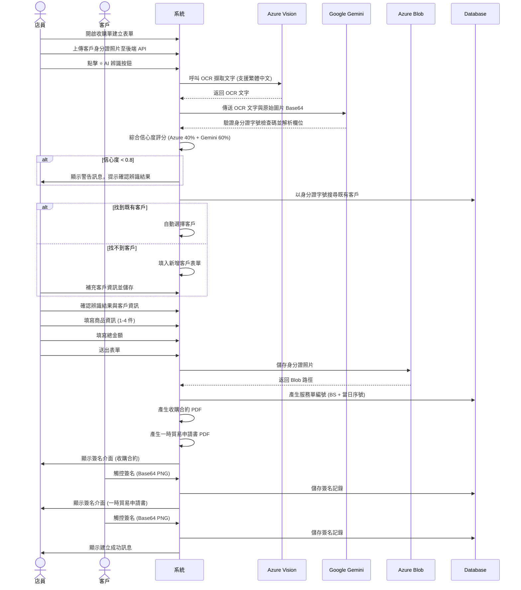
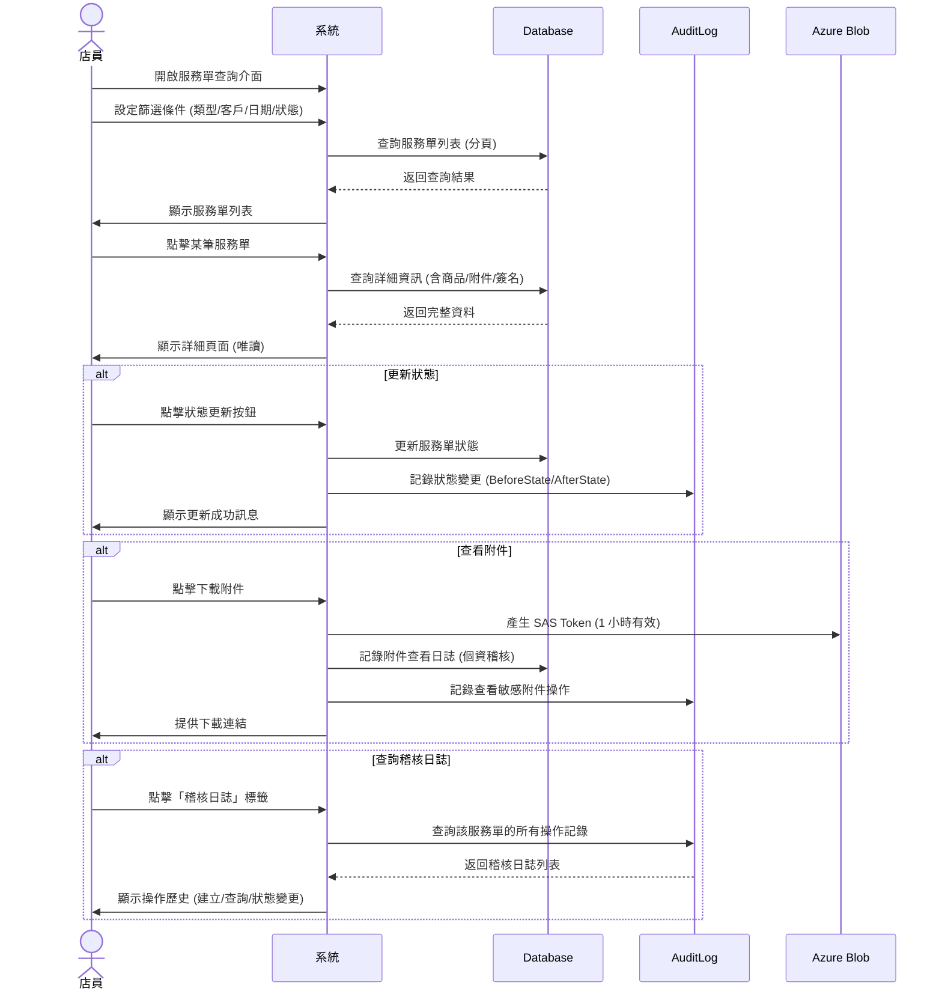

# Quickstart: 服務單管理模組

**Feature**: 服務單管理模組  
**Branch**: `007-service-order-management`  
**Date**: 2025-12-16

---

## 快速開始指南

本指南將協助開發者快速了解服務單管理模組的核心功能與使用方式。

---

## 功能概覽

服務單管理模組提供以下核心功能:

1. **收購單管理** (P1)
   - 線下收購單建立
   - 身分證 OCR 辨識 (Azure Vision + Google Gemini)
   - 線下簽名 (收購合約 + 一時貿易申請書)
   
2. **寄賣單管理** (P1)
   - 線下寄賣單建立
   - 商品配件與瑕疵記錄
   - 寄賣日期與續約設定
   - 線下簽名 (寄賣合約書)

3. **客戶管理** (P2)
   - 客戶搜尋 (姓名/電話/Email/身分證字號)
   - 新增客戶
   - AI 辨識後自動搜尋既有客戶

4. **服務單查詢** (P2)
   - 多條件篩選 (類型/客戶/日期/狀態)
   - 查看詳細資訊
   - 修改歷史追蹤
   - 附件管理

5. **線上服務單** (P3)
   - 線上表單建立
   - Dropbox Sign 線上簽名

---

## 核心業務流程

### 流程 1: 線下收購單建立



### 流程 2: 線下寄賣單建立

與收購單類似,但包含以下差異:

1. **商品項目**: 每件商品可獨立設定配件與瑕疵處 (多選)
2. **寄賣日期**: 設定起訖日期 (預設結束日期 = 起始日期 + 90 天)
3. **續約設定**: 選擇續約選項 (到期自動取回/第三個月起自動調降 10%/屆時討論)
4. **簽名文件**: 僅需簽署寄賣合約書 (單份文件)
5. **服務單編號**: `CS + YYYYMMDD + 001`

### 流程 3: 服務單查詢與狀態管理



---

## API 端點概覽

### 客戶管理

| 方法 | 端點 | 說明 | 權限 |
|------|------|------|------|
| GET | `/api/customers/search` | 搜尋客戶 | `customer.read` |
| POST | `/api/customers` | 新增客戶 | `customer.create` |

### 服務單管理

| 方法 | 端點 | 說明 | 權限 |
|------|------|------|------|
| POST | `/api/service-orders/buyback` | 建立收購單 | `serviceOrder.buyback.create` |
| POST | `/api/service-orders/consignment` | 建立寄賣單 | `serviceOrder.consignment.create` |
| GET | `/api/service-orders` | 查詢服務單列表 | `serviceOrder.*.read` |
| GET | `/api/service-orders/{id}` | 查詢服務單詳情 | `serviceOrder.*.read` |
| PATCH | `/api/service-orders/{id}/status` | 更新服務單狀態 | `serviceOrder.*.update` |
| GET | `/api/service-orders/{id}/audit-logs` | 查詢稽核日誌 | `serviceOrder.*.read` |

### OCR 辨識

| 方法 | 端點 | 說明 | 權限 |
|------|------|------|------|
| POST | `/api/ocr/id-card` | 辨識身分證 | `serviceOrder.*.create` |

### 附件管理

| 方法 | 端點 | 說明 | 權限 |
|------|------|------|------|
| POST | `/api/attachments` | 上傳附件 | `serviceOrder.*.create` |
| GET | `/api/attachments/{id}/sas-url` | 產生下載 URL | `serviceOrder.attachment.viewSensitive` |

### 簽名管理

| 方法 | 端點 | 說明 | 權限 |
|------|------|------|------|
| POST | `/api/service-orders/buyback/preview-pdf` | 填充模板產生 PDF 預覽 | `serviceOrder.buyback.create` |
| POST | `/api/service-orders/consignment/preview-pdf` | 填充模板產生 PDF 預覽 | `serviceOrder.consignment.create` |
| POST | `/api/service-orders/{id}/merge-signature` | 合併簽章到 PDF | `serviceOrder.*.create` |
| POST | `/api/service-orders/{id}/confirm` | 確認並儲存至 Blob | `serviceOrder.*.create` |
| POST | `/api/signatures/online` | 發送線上簽名邀請 | `serviceOrder.*.create` |
| POST | `/api/webhooks/dropbox-sign` | Dropbox Sign Webhook | 公開 (API Key 驗證) |

---

## 關鍵技術決策

### 1. 身分證 OCR 辨識

**技術方案**: Azure Vision + Google Gemini 雙重辨識

```plaintext
店員上傳身分證照片至後端 API (暫存於記憶體)
    ↓
Azure Vision 文字擷取 (支援繁體中文)
    ↓
傳送 OCR 文字與原始圖片 Base64 至 Gemini
    ↓
Gemini 驗證身分證字號檢查碼、解析姓名、出生日期等欄位
    ↓
綜合信心度評分 (Azure 40% + Gemini 60%)
    ↓
信心度 ≥ 0.8 → 自動填入
信心度 < 0.8 → 顯示警告訊息，提示店員確認
    ↓
店員確認完畢送出表單 → 儲存檔案至 Azure Blob Storage
```

**降級策略**: 若 Azure Vision 失敗,直接使用 Gemini Vision 辨識

### 2. 服務單編號生成

**格式**: `BS{YYYYMMDD}{001}` (收購單) 或 `CS{YYYYMMDD}{001}` (寄賣單)

**實作方式**:
- PostgreSQL 函數 `generate_daily_service_order_number()`
- 使用 Advisory Lock 確保並發安全
- 觸發器自動填充序號

### 3. 附件儲存與存取

**儲存**: Azure Blob Storage (`service-order-attachments` 容器)

**存取**: SAS Token (1 小時有效期)
- 快取機制: MemoryCache (TTL 55 分鐘)
- 個資稽核: 每次查看/下載記錄至 `attachment_view_logs`

### 4. 並發控制

**機制**: 樂觀鎖 (Optimistic Locking)

```sql
UPDATE service_orders
SET total_amount = @NewAmount,
    version = version + 1,
    updated_at = NOW()
WHERE id = @Id AND version = @ExpectedVersion;
```

若 `version` 不一致,返回錯誤訊息要求重新載入

---

## 資料庫 Schema 摘要

### 核心表格

1. **service_orders** - 服務單主表
   - `order_number` (計算欄位): `BS/CS + YYYYMMDD + 001`
   - 不允許修改內容,僅允許狀態變更
   
2. **product_items** - 商品項目 (1-4 件)
   - `accessories` (JSONB): 配件多選
   - `defects` (JSONB): 瑕疵多選
   
3. **signature_records** - 簽名記錄
   - `signature_type`: OFFLINE/ONLINE
   - `signature_data`: Base64 PNG (線下) / NULL (線上)
   - `dropbox_sign_request_id`: Dropbox Sign 請求 ID (線上)

4. **audit_logs** - 稽核日誌 (現有系統表)
   - 記錄所有服務單操作
   - 支援 BeforeState/AfterState

### 實體關聯

```
customers (1) ──> (N) service_orders
service_orders (1) ──> (N) product_items
service_orders (1) ──> (N) attachments
service_orders (1) ──> (N) signature_records
service_orders (1) ──> (N) attachment_view_logs
```

---

## 開發環境設定

### 必要環境變數

```bash
# Database
DATABASE_CONNECTION_STRING="Host=localhost;Database=v3_admin;Username=postgres;Password=xxx"

# Azure Blob Storage
AZURE_BLOB_CONNECTION_STRING="DefaultEndpointsProtocol=https;AccountName=xxx;..."
AZURE_BLOB_CONTAINER_NAME="service-order-attachments"

# Azure Computer Vision
AZURE_VISION_ENDPOINT="https://xxx.cognitiveservices.azure.com/"
AZURE_VISION_API_KEY="xxx"

# Google Gemini
GOOGLE_GEMINI_API_KEY="xxx"
GOOGLE_GEMINI_PROJECT_ID="xxx"

# Dropbox Sign
DROPBOX_SIGN_API_KEY="xxx"
DROPBOX_SIGN_CLIENT_ID="xxx"

# JWT
JWT_SECRET_KEY="xxx"
JWT_ISSUER="V3.Admin.Backend"
JWT_AUDIENCE="V3.Admin.Frontend"
```

### NuGet 套件

```xml
<!-- Azure SDKs -->
<PackageReference Include="Azure.Storage.Blobs" Version="12.x" />
<PackageReference Include="Azure.AI.Vision.ImageAnalysis" Version="1.x" />

<!-- Google SDKs -->
<PackageReference Include="Google.Cloud.AIPlatform.V1" Version="3.x" />

<!-- PDF 處理 -->
<PackageReference Include="PDFsharp" Version="6.x" />

<!-- Dropbox Sign (需自行實作 HTTP Client) -->
```

---

## 測試策略

### 單元測試

- **Validators**: 100% 覆蓋率
  - `CreateServiceOrderRequestValidator`
  - `UpdateServiceOrderRequestValidator`
  - `CreateCustomerRequestValidator`

- **Services**: 核心邏輯測試
  - `ServiceOrderService.CreateBuybackOrderAsync`
  - `ServiceOrderService.UpdateStatusAsync` (狀態轉換驗證)
  - `AuditLogService` 整合測試

### 整合測試

使用 **Testcontainers PostgreSQL**:
- 所有 API 端點
- 序號生成並發測試 (模擬 100 筆同時建立)
- Webhook 端點驗證
- AuditLogService 整合測試

### OCR 測試

準備 **30-50 張真實身分證照片樣本**:
- 台灣身分證 (新/舊版)
- 外籍居留證
- 不同光線條件
- 模糊/傾斜照片

---

## 常見問題 (FAQ)

### Q1: 為什麼使用 Azure Vision + Google Gemini 雙重辨識?

**A**: Azure Vision 對繁體中文 OCR 準確度高,Gemini 擅長語義理解與邏輯驗證 (如身分證字號檢查碼)。雙重辨識提供更高準確率與容錯性。

### Q2: 服務單編號每日重置如何確保並發安全?

**A**: 使用 PostgreSQL Advisory Lock + `SELECT FOR UPDATE SKIP LOCKED` 機制,確保同一時間僅一個交易可取得當日序號。

### Q3: 如何處理 SAS Token 過期問題?

**A**: 前端偵測 403 錯誤時,重新呼叫 `/api/attachments/{id}/sas-url` 取得新的 Token。後端快取 55 分鐘避免重複產生。

### Q4: 為什麼不允許修改服務單內容?

**A**: 寄賣單與收購單是具有法律效力的契約文件,一經簽署不應任意修改。如需更正應建立新的服務單並註記關聯,保留完整稽核軌跡。

### Q5: 如何追蹤服務單的操作歷史?

**A**: 使用系統現有的 AuditLogService,記錄所有服務單操作(建立、查詢、狀態變更、刪除)。狀態變更會記錄 BeforeState 與 AfterState,方便追蹤服務單生命週期。

### Q6: 線上簽名與線下簽名如何統一管理?

**A**: 使用單一 `signature_records` 表,透過 `signature_type` 欄位區分。線下儲存 Base64 PNG,線上儲存 Dropbox Sign Request ID。

---

---

## 下一步

1. **實作資料庫遷移腳本**: `Database/Migrations/007_CreateServiceOrderTables.sql`
2. **實作核心 Repository**: `ServiceOrderRepository`, `ProductItemRepository`
3. **實作核心 Service**: `ServiceOrderService`, `IdCardOcrService`
4. **實作 API Controllers**: `ServiceOrderController`, `CustomerController`
5. **撰寫單元測試與整合測試**

詳細的實作任務清單請參考 [tasks.md](tasks.md) (由 `/speckit.tasks` 命令生成)。
